## `01` · Quem está por trás dos testes?

Sou o **Lucas**, graduando em **Análise e Desenvolvimento de Sistemas na FATEC**. Tenho experiência de estágio com testes de software em aplicações desenvolvidas com **Laravel** e busco uma oportunidade como **QA Júnior**.

Atuei principalmente com **testes manuais**, utilizei **Insomnia para testes de API** e desenvolvi conhecimentos em **automação de testes com Cypress e Playwright**. Quero continuar aprendendo e contribuir com a qualidade dos produtos.

## `02` · Meu laboratório de QA 🐛

| Área | Experiência |
| :--- | :--- |
| **Testes manuais** | Testes em aplicações web durante o estágio |
| **Testes de API** | Uso do Insomnia para testar APIs |
| **Ambientes** | Variáveis no Insomnia para alternar configurações entre master e alpha |
| **Automação** | Conhecimentos em automação de testes com Cypress e Playwright |
| **Contexto técnico** | Aplicações desenvolvidas com Laravel |

## `03` · Projetos e estudos 📂

Estes repositórios reúnem meus estudos de programação e projetos acadêmicos.

| Repositório | Conteúdo |
| :--- | :--- |
| [Estudos de APIs](https://github.com/Lucas-Elias/Curso_Api--Learning-about-APIs) | Repositório do curso de APIs |
| [Estudos de Java](https://github.com/Lucas-Elias/dio-basic-java) | Exercícios e aprendizado de Java |
| [Programação web](https://github.com/Lucas-Elias/Exercicios-Prog-web1) | Exercícios das aulas de programação web |

## `04` · Histórico de contribuições 🐍

<picture>
  <source media="(prefers-color-scheme: dark)" srcset="https://raw.githubusercontent.com/Lucas-Elias/Lucas-Elias/output/github-snake-dark.svg" />
  <source media="(prefers-color-scheme: light)" srcset="https://raw.githubusercontent.com/Lucas-Elias/Lucas-Elias/output/github-snake.svg" />
  
</picture>

---

**Vamos conversar sobre qualidade de software?**

[Me encontre no LinkedIn ↗](https://www.linkedin.com/in/lucas-campos-qa/)

