### QA | Analista de Testes | Testes Manuais
**Web, PWA, Mobile e APIs | Estudante de ADS**

## `01` · Sobre mim

Sou **Lucas Campos**, estudante de **Análise e Desenvolvimento de Sistemas na Fatec Itapetininga**, com experiência em **Qualidade de Software (QA), desenvolvimento e suporte técnico**.

Busco uma oportunidade como **QA / Analista de Testes Júnior**, com foco em testes manuais e funcionais de aplicações **Web, PWA, Mobile e APIs REST**, além de desenvolver minha prática em automação de testes.

Na **Sonoda Ponto**, atuei na validação de sistemas de transporte interno de pacientes, limpeza hospitalar, estoque e help desk. Trabalhei com exploração de cenários, regras de negócio, permissões e configurações multitenant, além de investigar falhas em dispositivos móveis e na sincronização online/offline. Também participei da identificação, documentação, reprodução e acompanhamento de bugs e da validação das correções.

No início desse estágio, realizei um curso de **UI/UX**, que ampliou meu olhar para interfaces, usabilidade e experiência dos usuários. Na **Prefeitura de Itapetininga**, adquiri experiência com desenvolvimento de APIs, front-end, suporte técnico e manutenção de equipamentos.

## `02` · Meu laboratório de QA 🐛

| Área | Experiência e competências |
| :--- | :--- |
| **Qualidade de software** | Testes manuais, funcionais e exploração de cenários |
| **APIs REST e Insomnia** | Validação de requisições, respostas e limites de requisições (rate limiting) |
| **Web, PWA e Mobile** | Responsividade, compatibilidade e sincronização online/offline |
| **Sistemas multitenant** | Validação de configurações, regras de negócio e permissões de acesso |
| **Bugs** | Identificação, documentação, reprodução, acompanhamento e validação de correções |
| **UI/UX** | Avaliação de interfaces, navegação e usabilidade em diferentes condições de uso |
| **Notion e IA** | Apoio à exploração de cenários, com validação independente |
| **Automação de testes** | Em aprendizado: prática apoiada por IA, com foco na lógica dos testes e nas verificações de resultados |
| **SQL** | Competência destacada no LinkedIn |

## `03` · Experiência profissional

### Sonoda Ponto · Estagiário de garantia de qualidade de software
**Janeiro a setembro de 2026 · Itapetininga, São Paulo · Presencial**

Atuação em QA, realizando testes manuais e funcionais em aplicações Web, PWA, Mobile e APIs REST. Validação de regras de negócio, usabilidade, permissões e comportamento das aplicações em diferentes dispositivos e condições reais de uso.

- Testes funcionais e exploração de cenários em sistemas de transporte interno de pacientes, limpeza hospitalar, estoque e help desk, incluindo aplicações desenvolvidas em **Flutter**.
- Validação de configurações de uma plataforma **multitenant**, verificando parâmetros que alteravam fluxos e comportamentos para diferentes organizações.
- Testes de **permissões e níveis de acesso** para operações de visualização, criação, edição e exclusão.
- Testes de **APIs REST com Insomnia**, incluindo requisições, respostas e rate limiting.
- Testes de **responsividade e compatibilidade** em notebook e smartphone Motorola Moto G42 (4 GB de RAM), além de verificações em Chrome, Edge, Firefox e Opera GX.
- Validação da **sincronização e continuidade dos fluxos** durante alternâncias entre online e offline.
- Investigação de interrupções de fluxo no aplicativo móvel quando o Android encerrava seu processo por pressão de memória durante o uso da câmera.
- Identificação, documentação, reprodução e acompanhamento de **bugs**, com validação das correções realizadas pelo time de desenvolvimento.
- Aplicação dos conhecimentos do curso de **UI/UX** na avaliação de telas, navegação e fluxos.
- Uso de **IA** como apoio à exploração de cenários e possíveis falhas, com validação independente.

### Prefeitura de Itapetininga · Estagiário de TI
**Abril de 2025 a janeiro de 2026 · Itapetininga, São Paulo · Presencial**

Atuação em desenvolvimento, suporte técnico e manutenção de equipamentos para setores administrativos.

- Participação no desenvolvimento de **APIs e interfaces front-end** para sites.
- Suporte técnico aos setores administrativos.
- Manutenção de computadores e impressoras.

Essa experiência ampliou minha compreensão do funcionamento de aplicações e da identificação de problemas técnicos, formando uma base para minha atuação posterior em Qualidade de Software.

## `04` · Formação e aprendizado 🎓

**Fatec Itapetininga — Tecnologia em Análise e Desenvolvimento de Sistemas**  
Fevereiro de 2024 a dezembro de 2026 · Em andamento

Estudos de Java básico e linguagem C, conforme a formação apresentada no LinkedIn.

**Curso de UI/UX**  
Realizado no início do estágio na Sonoda Ponto, com aplicação dos conhecimentos em interfaces, navegação e experiência dos usuários.

**Voxy Proficiency Achievement Certificate — Voxy**  
Emitido em janeiro de 2026 · [Ver credencial](https://app.voxy.com/certificates/proficiency-test/69664e67fc967f3ca2a1c22a)

## `05` · Projetos e estudos 📂

### Zenit · Projeto acadêmico

Participei da apresentação do projeto **Zenit no 18º MIT da Fatec Itapetininga**, com uma proposta ligada aos Objetivos de Desenvolvimento Sustentável da ONU (ODS 2030).

A ideia busca tornar a web mais amigável e segura, com foco em pessoas neurodivergentes e disponibilidade para o público em geral. A proposta envolve filtros para estímulos, apoio ao controle do tempo online e maior autonomia sobre o consumo de conteúdo.

[Repositório do protótipo](https://github.com/Lucas-Elias/Zenit-Prototipo) · [Publicação compartilhada no LinkedIn](https://www.linkedin.com/feed/update/urn:li:activity:7340434042191822848/)

### Repositórios de aprendizado

| Repositório | Conteúdo |
| :--- | :--- |
| [Estudos de APIs](https://github.com/Lucas-Elias/Curso_Api--Learning-about-APIs) | Repositório do curso de APIs |
| [Estudos de Java](https://github.com/Lucas-Elias/dio-basic-java) | Exercícios e aprendizado de Java |
| [Programação web](https://github.com/Lucas-Elias/Exercicios-Prog-web1) | Exercícios das aulas de programação web |

## `06` · Histórico de contribuições 🐍

<picture>
  <source media="(prefers-color-scheme: dark)" srcset="https://raw.githubusercontent.com/Lucas-Elias/Lucas-Elias/output/github-snake-dark.svg" />
  <source media="(prefers-color-scheme: light)" srcset="https://raw.githubusercontent.com/Lucas-Elias/Lucas-Elias/output/github-snake.svg" />
  
</picture>

---

**Vamos conversar sobre qualidade de software?**

[Me encontre no LinkedIn ↗](https://www.linkedin.com/in/lucascampos-qa/)

